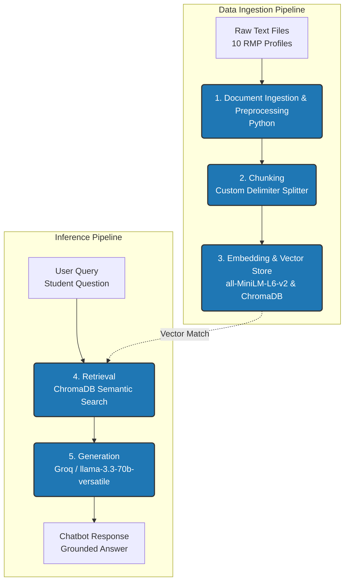

# Project 1 Planning: The Unofficial Guide

> Write this document before you write any pipeline code.
> Your spec and architecture diagram are what you'll use to direct AI tools (Claude, Copilot, etc.) to generate your implementation — the more specific they are, the more useful the generated code will be.
> Update the Retrieval Approach and Chunking Strategy sections if you change your approach during implementation.
> Update this file before starting any stretch features.

---

## Domain

<!-- What domain did you choose? Why is this knowledge valuable and hard to find through official channels? -->

The Unofficial Guide centralizes raw student feedback, experiences, and workload expectations for Computer Science professors and courses at CUNY Queens College. While official university catalogs and websites give students basic course descriptions and instructor names, they completely miss out on critical information, including exam difficulty, teaching quality, and student feedback. By making this data easily searchable, students will have access to knowledge that is difficult to find through official CUNY channels, which can help them better strategically pick their courses and professors.

---

## Documents

<!-- List your specific sources: URLs, subreddit names, forum threads, or file descriptions.
     Aim for at least 10 sources that together cover different subtopics or perspectives within your domain. -->

| # | Source | Description | URL or location |
| --- | --- | --- | --- |
| 1 | RateMyProfessor | Contains raw course-specific student feedback and ratings for Professor Akinlar. Data is condensed into a structured .txt file.| documents/akinlar.txt |
| 2 | RateMyProfessor | Contains raw course-specific student feedback and ratings for Professor Chyn. Data is condensed into a structured .txt file. | documents/chyn.txt |
| 3 | RateMyProfessor | Contains raw course-specific student feedback and ratings for Professor Gryak. Data is condensed into a structured .txt file. | documents/gryak.txt |
| 4 | RateMyProfessor | Contains raw course-specific student feedback and ratings for Professor Kahrobaei. Data is condensed into a structured .txt file. | documents/kahrobaei.txt |
| 5 | RateMyProfessor | Contains raw course-specific student feedback and ratings for Professor Lord. Data is condensed into a structured .txt file. | documents/lord.txt |
| 6 | RateMyProfessor | Contains raw course-specific student feedback and ratings for Professor Obrenic. Data is condensed into a structured .txt file. | documents/obrenic.txt |
| 7 | RateMyProfessor | Contains raw course-specific student feedback and ratings for Professor Ryba. Data is condensed into a structured .txt file. | documents/ryba.txt |
| 8 | RateMyProfessor | Contains raw course-specific student feedback and ratings for Professor Steinberg. Data is condensed into a structured .txt file. | documents/steinberg.txt |
| 9 | RateMyProfessor | Contains raw course-specific student feedback and ratings for Professor Telang. Data is condensed into a structured .txt file. | documents/telang.txt |
| 10 | RateMyProfessor | Contains raw course-specific student feedback and ratings for Professor Waxman. Data is condensed into a structured .txt file. | documents/waxman.txt |

---

## Chunking Strategy

<!-- How will you split documents into chunks?
     State your chunk size (in tokens or characters), overlap size, and explain why those
     numbers fit the structure of your documents.
     A review-heavy corpus warrants different chunking than a long FAQ. -->

**Chunk size:** Document-Structure-Based Chunks (variable size).

**Overlap:** No overlap.

**Reasoning:** 

Traditional fixed-size chunking techniques fail on this dataset because the text is not continuous. The data is highly structured and each student review is delimited by a `---` delimiter. Using arbitrary character limits could possibly split up a single review, seperating critical metadata such as ```Course``` or ```Review```. Also, we use no overlap because with overlap, it's possible that certain reviews can be mixed up where the end of one review is grabbed along with the start of another review.

Thus, it's best to use a document-structure-based chunking strategy, parsing each source document by the ```---``` delimiter so that one review equals one chunk. To ensure, no essential context is lost during the retrieval step, a preprocessing step is needed to extract the ```Professor Name``` along with global statistics from the top of each source document and prepend it to the text payload of each chunk. 

---

## Retrieval Approach

<!-- Which embedding model are you using (e.g., all-MiniLM-L6-v2 via sentence-transformers)?
     How many chunks will you retrieve per query (top-k)?
     If you were deploying this for real users and cost wasn't a constraint, what tradeoffs
     would you weigh in choosing a different embedding model — context length, multilingual
     support, accuracy on domain-specific text, latency? -->

**Embedding model:** all-MiniLM-L6-v2 model

**Top-k:** 5

Reasoning: If we specify the k value to be too low, we risk capturing a highly biased perspective. For example, if k was set to 1 and if we extracted one review from a student who failed the class and left very negative feedback, it's possible that the other reviews for that professor were positive, thus painting a inaccurate picture. In the case where we specify k to be a large value (e.g. k = 15), since each document source contains the 10 latest reviews for a certain professor, retrieving a large value of chunks that exceeds 10 would result in extracting data for different professors just to fill the quota. This will cause the LLM to hallucinate and cross-contaminate feedback between different professors.

**Production tradeoff reflection:**

While upgrading to a larger commerical embedding model (e.g. OpenAI's text-embedding-3-large model) would provide higher-dimensional vectors and thus capture more naunced sementic representations which would improve retrieval accuracy, this will also introduce network latency and token usage costs due to it requiring a external API call to access the model. The current embedding model runs locally, keeping retrieval latency near zero. Additionally, as mentioned before, each source document contains the latest 10 English reviews for a certain professor, thus a larger context window and multilingual support would be unecessary at this point.


---

## Evaluation Plan

<!-- List your 5 test questions with their expected correct answers.
     Questions should be specific enough that you can judge whether the system's response
     is right or wrong. "What are good dining halls?" is too vague.
     "What do students say about wait times at [dining hall name] during lunch?" is testable. -->

| # | Question | Expected answer |
|---|----------|-----------------|
| 1 | Does Professor Jerry Waxman allow students to use electronics like phones or computers during his lectures?| No. Multiple student reviews note that no technology or electronics are allowed in his class. If a phone is used, he will stop the lecture to address it.|
| 2 | What specific topics are covered on the exams for Bojana Obrenic's CSCI 320 course?| Exam 1 covers regular expressions, Godel numbers, DFA, NDFA, telescoping, and CFG. Exam 2 covers the Pumping Lemma, Turing Machines, and a cumulative review of Exam 1 material. The final exam is cumulative of both Exam 1 and Exam 2.|
| 3 | How is the grade broken down in Delaram Kahrobaei's CSCI 220 class offerred in the Spring semester?| The majority of the grade is heavily exam-based, structured as 40% for the midterm exam, 40% for the final exam, and 10% for homework assignments. (Note: Another review from December 2025 mentions a structure of 50% midterm and 50% final).|
| 4 | What advice do students give to prepare for exams in Cuneyt Akinlar's introductory CSCI 111 course?| Students recommend attending his lectures if you are a newbie, completing the provided practice problems weeks in advance, and specifically attending the very last lecture before an exam because he reveals the exact topics that will be tested.|
| 5 | What is a common student complaint regarding the formatting and presentation of Gaurish Telang's lecture slides?| Students complain that his lecture slides can be extremely disorganized and unclear, noting that he jams an impossible amount of information into a single slide.|

---

## Anticipated Challenges

<!-- What could go wrong? Name at least two specific risks with reasoning.
     Consider: noisy or inconsistent documents, missing source attribution, off-topic
     retrieval, chunks that split key information across boundaries. -->

1. Inconsistent Naming Conventions and Course Acronyms (Noisy data)

Reasoning: In the raw documnents, students refer to the exact same courses using different naming conventions. For example, the OOP course is written as CS212, CSC212, CSCI212, and 212. Because semantic search models rely on vector similarities, a query explicitly searching for CSCI212 might fail to retrieve a highly relevant review that's simply labeled as 212. 

2. Diverse topics noise and diluted embeddings

Reasoning: It's possible that a individual review covers  multiple completely unrelated topics in a short text span. For example, a single student review for Kenneth Lord simultaneously discusses dry lecturing styles, annoyed professors, predictable exams, and general career advice for entering software engineering. When this chunk is passed into the all-MiniLM-L6-v2 embedding model, the single vector representation becomes diluted across all 4 topics making it harderfor the system to distinguish between relevant and irrelevant information.

---

## Architecture

<!-- Draw a diagram of your pipeline showing the five stages:
     Document Ingestion → Chunking → Embedding + Vector Store → Retrieval → Generation
     Label each stage with the tool or library you're using.
     You can use ASCII art, a Mermaid diagram, or embed a sketch as an image.
     You'll use this diagram as context when prompting AI tools to implement each stage. -->

---

## AI Tool Plan

<!-- For each part of the pipeline below, describe:
     - Which AI tool you plan to use (Claude, Copilot, ChatGPT, etc.)
     - What you'll give it as input (which sections of this planning.md, which requirements)
     - What you expect it to produce
     - How you'll verify the output matches your spec

     "I'll use AI to help me code" is not a plan.
     "I'll give Claude my Chunking Strategy section and ask it to implement chunk_text()
     with my specified chunk size and overlap" is a plan. -->

**Milestone 3 — Ingestion and chunking:**

AI Tool: Claude 4.6 Sonnet

Input Context Provided:

- Sample RateMyProfessor Text Documents
- Chunking strategy section
- Architecture diagram

Expected Output: 

A Python preprocessing script (```ingest.py```) that parses all 10 text files. It must isolate the professor's name and global historical statistics from the file header, split the rest of the text into blocks using the ```---``` markdown delimiter, and return a clean array of chunk payloads with the header prepended to each review.

Verification Method: 

I will write a simple test script to print chunks[0] and chunks[1] of a parsed file. I will manually verify that:
- The text explicitly starts with the matching professor's name and global stats
- The chunk contains exactly one student's complete review without being cut off
- The length of the array matches the exact count of ```---``` delimiters present in the source file

**Milestone 4 — Embedding and retrieval:**

AI Tool: Claude 4.6 Sonnet

Input Context Provided: 
- Retrieval Approach section
- the Architecture Diagram
- chunking output structure from Milestone 3

Expected Output: 

A Python script (`vector_store.py`) that sets up a local, persistent ChromaDB client using `all-MiniLM-L6-v2` via `sentence-transformers`. It will handle batch-inserting our chunked reviews and produce a query function that returns the `top_k=5` matches.

Verification Method:

I will execute the query function using Question 1 and Question 4 from my Evaluation Plan. I will verify that exactly 5 matches are returned and that the text contents of the highest-ranked results mirror the source documents of Jerry Waxman and Cuneyt Akinlar respectively.  

**Milestone 5 — Generation and interface:**

AI Tool: Claude 4.6 Sonnet

Input Context Provided: 
- Completed planning.md (specifically the Evaluation Plan and Architecture Diagram) 
- Completed vector_store.py script

Expected Output: 

A chat application script (app.py) that establishes a connection to the Groq API utilizing the llama-3.3-70b-versatile model. The script must take a user's prompt, pull the 5 relevant chunks from ChromaDB, inject them into a system prompt ("Answer the question using only the following context..."), and print the response.

Verification Method: 

I will run all 5 questions from my Evaluation Plan through the completed chatbot interface. I will verify success by cross-checking the chatbot's terminal output against the explicit "Expected Answer" column in my evaluation plan to ensure all factual points are present with zero hallucinations.